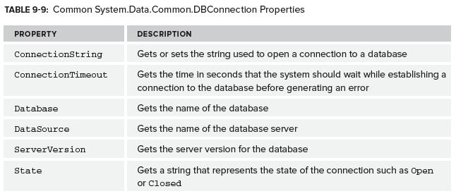

# 2\. Connecting to a Database

You need a connection string. Connections in .NET all inherit from the `DbConnection` base class. `SqlConnection` is used to connection to a SQL Server database. Connections must be closed after use - they are not managed. The `DbConnection` class implements `IDisposable` so is automatically closed by a using statement.



If necessary, connection strings can be built using a class that derives from `DbConnectionStringBuilder`, e.g. `OracleConnectionStringBuilder` or `SqlConnectionStringBuilder`.

```csharp
var stringBuilder = new SqlConnectionStringBuilder();

stringBuilder.DataSource = @"(localdb)\v11.0";
stringBuilder.InitialCatalog = "ProgrammingInCSharp";

string connectionString = stringBuilder.ToString(); 
   ```

Best practice is to not create connection strings programmatically, but to store them in app.config or web.config:  

```xml
<configuration>
    <connectionStrings>
        <add name="testConnectionString"
             providerName="System.Data.SqlClient"
             connectionString="Data Source=(localdb)\v11.0;Initial Catalog=ProgrammingInCSharp;" />
    </connectionStrings>
</configuration>
```
You can then access them through the System.Configuration.dll. Connection strings can be accessed by index or name:

```csharp
string connectionString = ConfigurationManager.ConnectionStrings["testConnectionString"].ConnectionString;  
```
 

## Connection Pools

SQL Server enables connection pooling by default. This is an optimisation technique that maintains a pool of connections. When someone requests a connection and there is already an open connection in the pool then the connection is reused. This stops connections being created on each request.
<!--stackedit_data:
eyJoaXN0b3J5IjpbMjEzNzM5NTgyMiwtODYyMzk0MjI0LC0yNz
I4MjM4MzAsODk1OTk5MzU3XX0=
-->