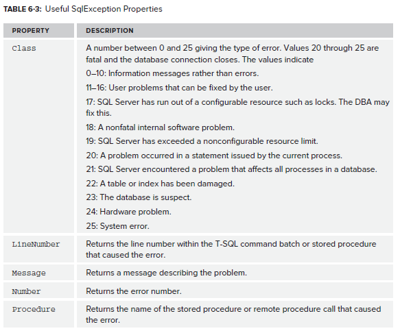

# SQL Exceptions

`System.Data.Common.DbException` is the base class for `OdbcException`, `OleDbException`, `OracleException` and `System.Data.SqlClient.SqlException`.

<!--stackedit_data:
eyJoaXN0b3J5IjpbMTM4MjM0MTU0MCwyNzQxMDc2MzhdfQ==
-->