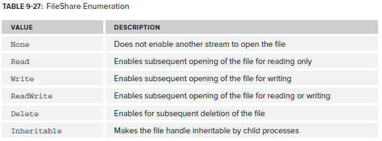

# 2\. Backing Store Streams
Key backing store streams:



## FileStream

FileStream derives from Stream and is used to read/write byte objects. FileStream supports reading/writing/seeking bytes in files. Note that Write() is synchronous. You can either use the static File class to retrieve a FileStream reference or instantiate a new FileStream object yourself which gives you more control.

```csharp
string path = @"C:\temp\test.txt";

using (FileStream stream = File.Create(path))
{
    string value = "Simon";
    byte[] data = Encoding.UTF8.GetBytes(value);
    stream.Write(data, 0, data.Length);
}
```

A FileStream can also be used to read data from a stream.

```csharp
string path = @"C:\temp\test.txt";

using (FileStream stream = File.OpenRead(path))
{
    byte[] data = new byte[stream.Length];

    for (int i = 0; i < stream.Length; i++)
    {
        data[i] = (byte)stream.ReadByte();
    }

    Console.WriteLine(Encoding.UTF8.GetString(data));
}

Console.ReadKey();
```

The FileStream constructor can take three enums as parameters: file mode, file access and file share.


FileAccess determines what you can do with the stream after it's created:


FileShare determines what others can do with the file whilst you have it open:


<!--stackedit_data:
eyJoaXN0b3J5IjpbLTU3MDYzMTM1MiwtMTYxMjY4OTk4NiwtNj
k4MDkwMV19
-->