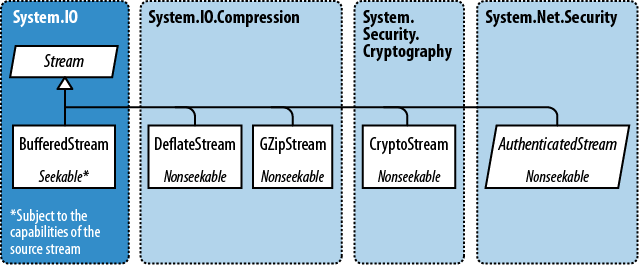

# 3\. Decorator Streams
Decorator streams:



## BufferedStream
This is used to improve performance by reducing the number of trips to the backing store. Here the `FileStream` is wrapped in a 20K buffer. Note that a `FileStream` already has a built-in buffer, so the only value of using this example could be to increase the buffer size.

```csharp
// Write 100K to a file:
File.WriteAllBytes ("myFile.bin", new byte [100000]);
using (FileStream fs = File.OpenRead ("myFile.bin"))
{
    using (BufferedStream bs = new BufferedStream (fs, 20000)) //20K buffer
    {
        bs.ReadByte();
        Console.WriteLine (fs.Position); // 20000
    }
}
```

## CryptoStream
See  [Asymmetric Encryption](../Security/3.%20Asymmetric%20Encryption.md). Below, the `StreamWriter` receives the plain text and passes it to the `CryptoStream`. It is then encrypted and the output is passed to the `MemoryStream`. Finally, the encrypted data is read from the `MemoryStream` and stored in `cipherData`.

```csharp
private byte[] EncryptString(string plainData, byte[] IV, byte[] key)
{
    SymmetricAlgorithm cryptoAlgorithm = SymmetricAlgorithm.Create();
    ICryptoTransform encryptor = cryptoAlgorithm.CreateEncryptor(key, IV);
    byte[] cipherData = new byte[0];

    using (MemoryStream msEncrypt = new MemoryStream())
    {
        using (CryptoStream csEncrypt = new CryptoStream(msEncrypt, encryptor, CryptoStreamMode.Write))
        {
            StreamWriter swEncrypt = new StreamWriter(csEncrypt);
            swEncrypt.Write(plainData);
            swEncrypt.Close();
            csEncrypt.Clear();
            cipherData = msEncrypt.ToArray();
        }
    }

    return cipherData;
}
```

And to decrypt:

```csharp
private string DecryptString(byte[] cipherData, byte[] IV, byte[] key)
{
    SymmetricAlgorithm cryptoAlgorythm = SymmetricAlgorithm.Create();
    ICryptoTransform decryptor = cryptoAlgorythm.CreateDecryptor(key, IV);
    string plainText = string.Empty;

    using (MemoryStream msDecrypt = new MemoryStream(cipherData))
    {
        using (CryptoStream csDecrypt = new CryptoStream(msDecrypt, decryptor, CryptoStreamMode.Read))
        {
            StreamReader srDecrypt = new StreamReader(csDecrypt);
            plainText = srDecrypt.ReadToEnd();

            srDecrypt.Close();
            csDecrypt.Clear();
        }
    }
    return plainText;
}
```

## Compression
There are two classes: `DeflateStream` and `GZipStream`. `GZipStream` adds  a CRC for error checking and conforms to more standards. Note that there is now also `ZipArchive` and `ZipFile` for .zip files.

```csharp
using (Stream s = File.Create ("compressed.bin"))
    using (Stream ds = new DeflateStream (s, CompressionMode.Compress))
        for (byte i = 0; i < 100; i++)
            ds.WriteByte (i);

using (Stream s = File.OpenRead ("compressed.bin"))
    using (Stream ds = new DeflateStream (s, CompressionMode.Decompress))
        for (byte i = 0; i < 100; i++)
            Console.WriteLine (ds.ReadByte());
```
<!--stackedit_data:
eyJoaXN0b3J5IjpbMTgyMzc3MDA1MywxMzQ5NzA3NDE0XX0=
-->