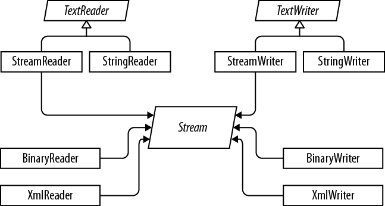

# 4\. Stream Adapters
A stream only deals in bytes. To convert the bytes into e.g. strings or XML you need to use an adaper.

Readers and writers:



## Readers and Writers


See Strings for StringReader/StringWriter

## StreamWriter/StreamReader
StreamWriter inherits from the abstract TextWriter class and lets you write characters to the file.

```csharp
using (FileStream fs = File.Create("test.txt"))
{
    using (TextWriter writer = new StreamWriter(fs))
    {
        writer.WriteLine("Line1");
        writer.WriteLine("Line2");
    }
}
```

Or you can use the static File class to return a FileStream object:

```csharp
string path = @"C:\temp\test.txt";

using (StreamWriter stream = File.CreateText(path))
{
    string value = "Simon2";
    stream.Write(value);
}
```

StreamReader is the equivalent class that is used to read from a text file. It inherits from the abstract TextReader and lets you read characters from a file.

```csharp
using (FileStream fs = File.OpenRead("test.txt"))
{
    using (TextReader reader = new StreamReader(fs))
    {
        Console.WriteLine(reader.ReadLine());
        Console.WriteLine(reader.ReadLine());
    }
}
```

Or you can use the static File class to return a FileStream object:

```csharp
string path = @"C:\temp\test.txt";

using (StreamReader stream = File.OpenText(path))
{
    Console.WriteLine(stream.ReadLine());
}

Console.ReadKey();
```

Encoding/Decoding
A char is a single Unicode character that uses two bytes in memory. System.Text.Encoding is a class that helps convert between bytes and strings. There are several encoding standards implemented in .NET. UTF8 is the standard, but there's also UTF7, UTF32, ASCII, BigEndianUnicode.

When working with text files, the File.CreateText() method creates a UTF8 encoded text file and returns a StreamWriter object. 


BinaryReader & BinaryWriter
Reads/writes a stream from/to binary. It is efficient as it deals with binary. Optionally, you can choose the encoding.  The constructor requires a stream.


const string fileName = "AppSettings.dat";

static void Main()
{
    WriteDefaultValues();
    DisplayValues();

    Console.Read();
}

public static void WriteDefaultValues()
{
    using (BinaryWriter writer = new BinaryWriter(File.Open(fileName, FileMode.Create)))
    {
        writer.Write(1.250F);
        writer.Write(@"c:\Temp");
        writer.Write(10);
        writer.Write(true);
    }
}

public static void DisplayValues()
{
    float aspectRatio;
    string tempDirectory;
    int autoSaveTime;
    bool showStatusBar;

    if (File.Exists(fileName))
    {
        using (BinaryReader reader = new BinaryReader(File.Open(fileName, FileMode.Open)))
        {
            aspectRatio = reader.ReadSingle();
            tempDirectory = reader.ReadString();
            autoSaveTime = reader.ReadInt32();
            showStatusBar = reader.ReadBoolean();
        }

        Console.WriteLine("Aspect ratio set to: " + aspectRatio);
        Console.WriteLine("Temp directory is: " + tempDirectory);
        Console.WriteLine("Auto save time set to: " + autoSaveTime);
        Console.WriteLine("Show status bar: " + showStatusBar);
    }
}


<!--stackedit_data:
eyJoaXN0b3J5IjpbMTQ5MzY1MjI1MiwtMTE3MzUxOTQwOV19
-->