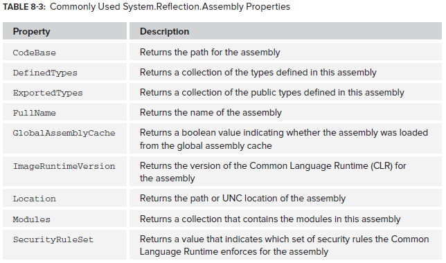
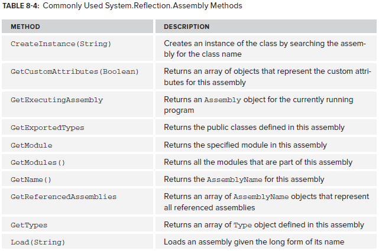

# The Assembly Class


Used to load the assembly, read metadata about the assembly and create instances of the types in the assembly. 



Example usage:

```csharp
Assembly assembly = Assembly.Load("System.Data, Version=4.0.0.0, Culture=neutral, PublicKeyToken=b77a5c561934e089");

Console.WriteLine(assembly.CodeBase);
Console.WriteLine(assembly.FullName);
Console.WriteLine(assembly.GlobalAssemblyCache);
Console.WriteLine(assembly.ImageRuntimeVersion);
Console.WriteLine(assembly.Location);

Console.Read();
```

## Method Usage




E.g:

```csharp
Assembly assembly = Assembly.GetExecutingAssembly();
Type[] types = assembly.GetTypes();

foreach (Type type in types)
{
    Console.WriteLine(type.Name);
}

Console.Read();
```

A module is a file that composes an assembly. This gets all modules defined in System.Data:

```csharp
Assembly assembly = Assembly.Load("System.Data, Version=4.0.0.0, Culture=neutral, PublicKeyToken=b77a5c561934e089");

Module[] modules = assembly.GetModules();

foreach (Module module in modules)
{
    Console.WriteLine(module.Name);
}

Console.Read();
```

## Loading Assemblies
The examples above used the Load() method. This enables you to execute code within the assembly. If you don't need to actually execute code within the assembly you can use the ReflectionOnlyLoad() method.

You can also use LoadFrom() and LoadFile(). Both take a filepath of an assembly as a parameter, but by using LoadFrom() you may be redirected to another assembly at a different path that has the same identity if one is already loaded in the LoadFrom context. This is done through probing the GAC and a few other places. LoadFile() is used to load exactly what you have specified. IO permissions are required to access the assembly at a given path. Load() is recommended.

## CreateInstance()
Note that null will be returned if you pass into CreateInstance() the name of a type that doesn't exist.

```csharp
Assembly assembly = Assembly.Load("System.Data, Version=4.0.0.0, Culture=neutral, PublicKeyToken=b77a5c561934e089");
DataTable dt = (DataTable)assembly.CreateInstance("System.Data.DataTable");
```

Assembly.CreateInstance actually calls Activator.CreateInstance. But you can call it directly:


```csharp
class Program
    {
        static void Main(string[] args)
        {
            Assembly pluginAssembly = Assembly.Load("ReflectionExample");

            var plugins = from type in pluginAssembly.GetTypes()
                          where typeof(IPlugin).IsAssignableFrom(type) && !type.IsInterface
                          select type;

            foreach (Type pluginType in plugins)
            {
                IPlugin plugin = Activator.CreateInstance(pluginType) as IPlugin;

                Console.WriteLine(plugin.Name);
                Console.WriteLine(plugin.Description);
                plugin.Load();
            }

            Console.ReadKey();
        }
    }

    public interface IPlugin
    {
        string Name { get; }
        string Description { get; }
        bool Load();
    }

    public class MyPlugin : IPlugin
    {
        public string Name
        {
            get { return "MyPlugin"; }
        }

        public string Description
        {
            get { return "My Sample Plugin"; }
        }

        public bool Load()
        {
            Console.WriteLine("MyPlugin Loaded");
            return true;
        }
    }
```
<!--stackedit_data:
eyJoaXN0b3J5IjpbNDI0ODI0MjQ0LC0xODg4Nzc3MzM2XX0=
-->