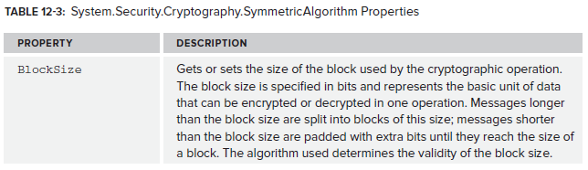
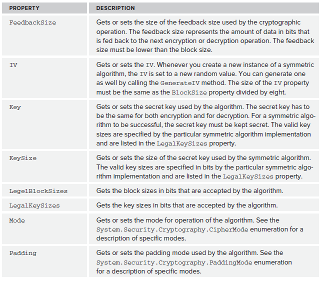
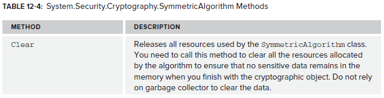
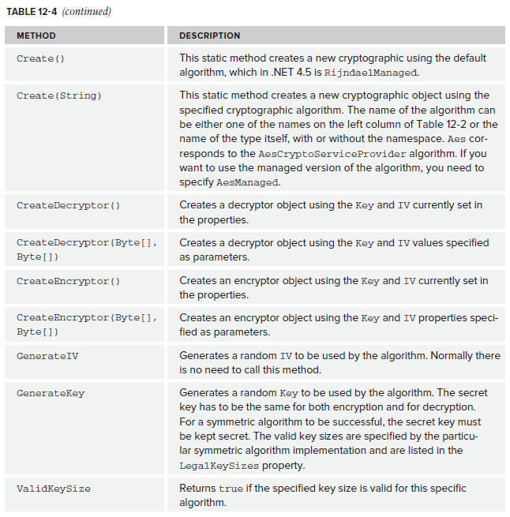

# 1\. Symmetric Encryption

- One key to encrypt and decrypt
- Fast
- An initialisation vector (IV) adds randomness to an encryption to stop the same string encrypting into the same cypher text every time.
- The cryptography classes are in `System.Security.Cryptography`.


There are five different symmetric encryption algorithms that are implemented in .NET:

- [Advanced Encryption Standard (AES)](2.%20Advanced%20Encryption%20Standard%20%28AES%29.md). Implemented with `AesManaged` and `AesCryptoServiceProvider`.
- Data Encryption Standard (DES). Implemented with `DESCryptoServiceProvider`.
- Rivest Cipher (RC2). Implemented by `RC2CryptoServiceProvider`.
- Rijndael. Implemented by `RinjdaelManaged`.
- Triple Data Encryption Standard (TripleDES). Implemented by `TripleDESCryptoServiceProvider`.


All inherit from the `SymmetricAlgorithm` class:







You can use the base symmetric encryption class to encrypt. Done this way, you have the flexibility to easily change the algorithm that is used. Note that not passing arguments to `Create()` means that the default algorithm is used - `RijndaelManaged`:

```csharp
private byte[] EncryptData(byte[] plainData, byte[] IV, byte[] key)
{
    SymmetricAlgorithm cryptoAlgorithm = SymmetricAlgorithm.Create();
    ICryptoTransform encryptor = cryptoAlgorithm.CreateEncryptor(key, IV);
    byte[] cipherData = encryptor.TransformFinalBlock(plainData, 0, plainData.Length);

    return cipherData;
}
```

And to decrypt:

```csharp
private byte[] DecryptData(byte[] cipherData, byte[] IV, byte[] key)
{
    SymmetricAlgorithm cryptoAlgorithm = SymmetricAlgorithm.Create();
    ICryptoTransform decryptor = cryptoAlgorithm.CreateDecryptor(key, IV);
    byte[] plainData = decryptor.TransformFinalBlock(cipherData, 0, cipherData.Length);

    return plainData;
}
```
<!--stackedit_data:
eyJoaXN0b3J5IjpbLTE0MjE3OTU1ODEsLTEyNjA1NzU3MDksLT
E0ODE3ODQ4NDZdfQ==
-->