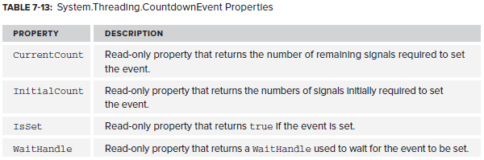
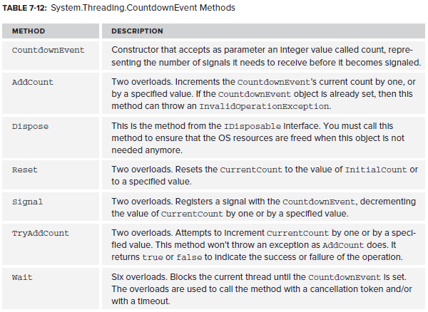

# CountdownEvent

This is used to wait for a set number of threads to finish their work. This can also be done using `WaitHandle.WaitAll()`. The `CountdownEvent` object doesn't inherit from `WaitHandle`. However, it does have a `WaitHandle` property that returns a `WaitHandle` that can be used where needed.

https://msdn.microsoft.com/en-us/library/system.threading.countdownevent(v=vs.110).aspx

<!--stackedit_data:
eyJoaXN0b3J5IjpbMjA0NDg3NTM5MV19
-->