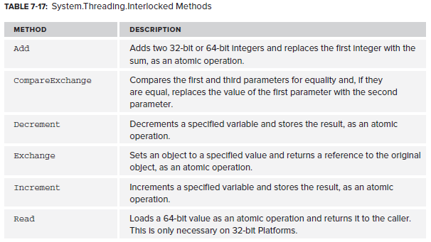

# Lock-Free Alternatives/Interlocked

This object ensures atomic operations on variables shared by multiple threads. Used to prevent the Windows scheduler switching threads midway through a sequence of common operations:



Example of usage:

```csharp
public static void InterlockedExample()
{
    int n = 0;

    //Interlocked ensures incrementing a value is an atomic action,
    var up = Task.Run(() =>
    {
        for (int i = 0; i < 1000000; i++)
        {
            Interlocked.Increment(ref n);
        }
    });

    for (int i = 0; i < 1000000; i++)
    {
        Interlocked.Decrement(ref n);
    }

    up.Wait();

    Console.WriteLine(n);
    Console.ReadKey();

    //you can also switch two values
    int previousNumber = Interlocked.Exchange(ref n, 6);

    //this checks the value before changing it
    int previousNumber2 = Interlocked.CompareExchange(ref n, 7, 6);

    Console.WriteLine(n);
    Console.ReadKey();
}
```

https://msdn.microsoft.com/en-us/library/system.threading.interlocked(v=vs.110).aspx

<!--stackedit_data:
eyJoaXN0b3J5IjpbMTc1NDA3OTU1LC0yMDQ4NzY1NDhdfQ==
-->