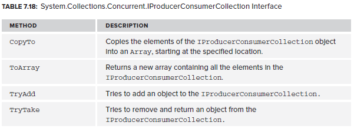

# Concurrent Collections

There are several concurrent collections that are designed to be thread safe. They are in `System.Collections.Concurrent`. Except for `ConcurrentDictionary`, all concurrent collections written by Microsoft implement `IProducerConsumerCollection`.

Concurrent collections:

Example of usage:

public static void BlockingCollectionExample()
{
    //BlockingCollection<T> is a thread safe collection for adding/removing data.
    //It is a wrapper for ConcurrentQueue by default
    //Use CompleteAdding() to signal that no more items will be added - this will unblock other threads waiting for new items
    BlockingCollection<string> collection = new BlockingCollection<string>();
    Task read = Task.Run(() =>
    {
        //while (true)
        //{
        //    //this call is blocked until there is an item to take
        //    Console.WriteLine(collection.Take());
        //}

        //you can use GetConsumingEnumerable() instead of while(true) - it is blocked until it finds a new item
        foreach (var item in collection.GetConsumingEnumerable())
        {
            Console.WriteLine(item);
        }
    });

    Task write = Task.Run(() =>
    {
        while (true)
        {
            string s = Console.ReadLine();

            if (string.IsNullOrWhiteSpace(s))
                break;

            collection.Add(s);
        }
    });

    write.Wait();
}

public static void ConcurrentBagExample()
{
    //this is a threadsafe collection. Duplicates are allowed and there is no order
    ConcurrentBag<int> bag = new ConcurrentBag<int>();

    bag.Add(42);
    bag.Add(21);

    int result;
    if (bag.TryTake(out result))
        Console.WriteLine(result);

    //remember that an item might be taken out of the collection by another thread after you've peeked!
    if (bag.TryPeek(out result))
        Console.WriteLine("The next item is: {0}", result);

    //IEnumerable<T> is implemented so you can iterate over a ConcurrentBag.
    //it works by making a snapshot of the collection at the start of the iteration - new items will be missed.
    foreach (var item in bag)
    {
        Console.WriteLine(item);
    }

    Console.ReadKey();
}

public static void ConcurrentStackExample()
{
    //last in, first out threadsafe collection

    var stack = new ConcurrentStack<int>();

    stack.Push(42);

    int result;
    if (stack.TryPop(out result))
        Console.WriteLine("Popped: {0}", result);

    stack.PushRange(new int[] { 1, 2, 3 });

    int[] values = new int[2];
    stack.TryPopRange(values);

    stack.Push(43);

    //IEnumerable<T> is implemented so you can iterate.
    //it works by making a snapshot of the collection at the start of the iteration - new items will be missed.
    foreach (var item in values)
    {
        Console.WriteLine(item);
    }

    Console.ReadKey();
}

public static void ConcurrentQueueExample()
{
    //first in, first out threadsafe collection

    var queue = new ConcurrentQueue<int>();
    queue.Enqueue(42);

    int result;
    if (queue.TryDequeue(out result))
        Console.WriteLine("Dequeued: {0}", result);

    queue.Enqueue(43);

    //IEnumerable<T> is implemented so you can iterate.
    //it works by making a snapshot of the collection at the start of the iteration - new items will be missed.
    foreach (var item in queue)
    {
        Console.WriteLine(item);
    }

    Console.ReadKey();
}

public static void ConcurrentDictionaryExample()
{
    //threadsafe key/value pairs
    var dictionary = new ConcurrentDictionary<string, int>();

    if (dictionary.TryAdd("k1", 42))
        Console.WriteLine("Added");

    if (dictionary.TryUpdate("k1", 21, 42))
        Console.WriteLine("42 updated to 21");

    dictionary["k1"] = 42;

    //if k1 doesn't exist then create it and give it the value 3, else double the existing value
    int r1 = dictionary.AddOrUpdate("k1", 3, (key, oldValue) => oldValue * 2 );

    //gets the value of k2 if it exists, else create it with the value of 3
    int r2 = dictionary.GetOrAdd("k2", 3);

    Console.ReadKey();
}

<!--stackedit_data:
eyJoaXN0b3J5IjpbNTY5NDE0NTAxXX0=
-->