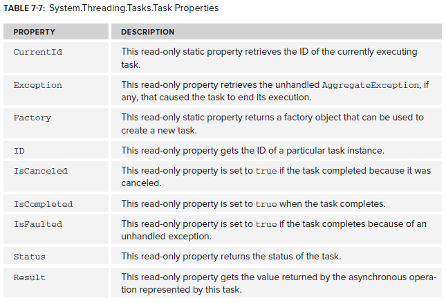

# Tasks

Tasks can be created in several ways:
- Create an instance of `Task` and call `Start()`.
- Call` TaskFactory.StartNew()`.
- Call `Task.Run()` - this is a wrapper for `TaskFactory.StartNew()`.
- Call one of the continuation methods - `WhenAll`, `WhenAny`, `ContinueWhenAll`, `ContinueWhenAny`.




A Task object tells you if work has been completed and what the result is. Use Task when there is no return value and `Task<T>` when there is:

```csharp
Task t1 = Task.Run(() =>
{
    for (int i = 0; i < 100; i++)
    {
        Console.Write("*");
    }
});

Task<int> t2 = Task.Run(() =>
{
    for (int i = 0; i < 100; i++)
    {
        Console.Write("*");
    }

    return 42;
});

t1.Wait(); //wait for the task to finish

//reading the result causes the code to wait until the thread has finished - Wait() is not required
Console.WriteLine(t2.Result);

Console.ReadKey();
```

`ContinueWith()` allows something to execute after a task has finished. There are overloads that let you handle tasks completing, cancelling and throwing an exception:

```csharp
Task<int> t = Task.Run(() =>
{
    return 42;
});

t.ContinueWith((i) =>
{
    Console.WriteLine("Cancelled");
}, TaskContinuationOptions.OnlyOnCanceled);

t.ContinueWith((i) =>
{
    Console.WriteLine("Faulted");
}, TaskContinuationOptions.OnlyOnFaulted);

var completedTask = t.ContinueWith((i) =>
{
    Console.WriteLine("Completed");
}, TaskContinuationOptions.OnlyOnRanToCompletion);

completedTask.Wait();

Console.ReadKey();
```

A task can also have child tasks:

```csharp
Task<Int32[]> parent = Task.Run(() =>
    {
        var results = new Int32[3];
        new Task(() => results[0] = 0, TaskCreationOptions.AttachedToParent).Start();
        new Task(() => results[1] = 1, TaskCreationOptions.AttachedToParent).Start();
        new Task(() => results[2] = 2, TaskCreationOptions.AttachedToParent).Start();

        return results;
    });

var finalTask = parent.ContinueWith(parentTask =>
{
    foreach (int i in parentTask.Result)
    {
        Console.WriteLine(i);
    }
});

finalTask.Wait();

Console.ReadKey();
```

A task factory can be used to start multiple tasks with the same options. This is the code above simplified:

```csharp
Task<Int32[]> parent = Task.Run(() =>
{
    var results = new Int32[3];

    TaskFactory tf = new TaskFactory(TaskCreationOptions.AttachedToParent, TaskContinuationOptions.ExecuteSynchronously);

    tf.StartNew(() => results[0] = 0);
    tf.StartNew(() => results[1] = 1);
    tf.StartNew(() => results[2] = 2);

    return results;
});

var finalTask = parent.ContinueWith(parentTask =>
{
    foreach (int i in parentTask.Result)
    {
        Console.WriteLine(i);
    }
});

finalTask.Wait();

Console.ReadKey();
```


There are several options that can be passed to `StartNew()` via the `TaskCreationOptions` enumeration. It is decorated with the `FlagsAttribute` so options can be combined together.


https://msdn.microsoft.com/en-us/library/system.threading.tasks.taskcreationoptions(v=vs.110).aspx

`WaitAll()` lets you wait for an array of tasks to finish:

```csharp
Task[] tasks = new Task[3];

tasks[0] = Task.Run(() =>
{
    Thread.Sleep(1000);
    Console.WriteLine("1");
    return 1;
});

tasks[1] = Task.Run(() =>
{
    Thread.Sleep(1000);
    Console.WriteLine("2");
    return 2;
});

tasks[2] = Task.Run(() =>
{
    Thread.Sleep(1000);
    Console.WriteLine("3");
    return 3;
});

Task.WaitAll(tasks);

int i = Task.WaitAny(tasks);
Task<int> completedTask = tasks[i];

Console.ReadKey();
```

`WhenAll()` lets you schedule a continuation method after all Tasks have finished. `WaitAny()` lets you wait until one of the tasks is finished. An optional parameter lets you set a timeout:

```csharp
int i = Task.WaitAny(tasks, 1000);
Task< int> completedTask = tasks[i];
```

Cancelling Tasks
This is done as follows:

1. Create a CancellationTokenSource object.
2. CancellationTokenSource.Token is passed to the task.
3. To cancel the task, call CancellationTokenSource.Cancel().

https://msdn.microsoft.com/en-us/library/system.threading.cancellationtokensource(v=vs.110).aspx

<!--stackedit_data:
eyJoaXN0b3J5IjpbLTE0OTgwNzA3MjhdfQ==
-->